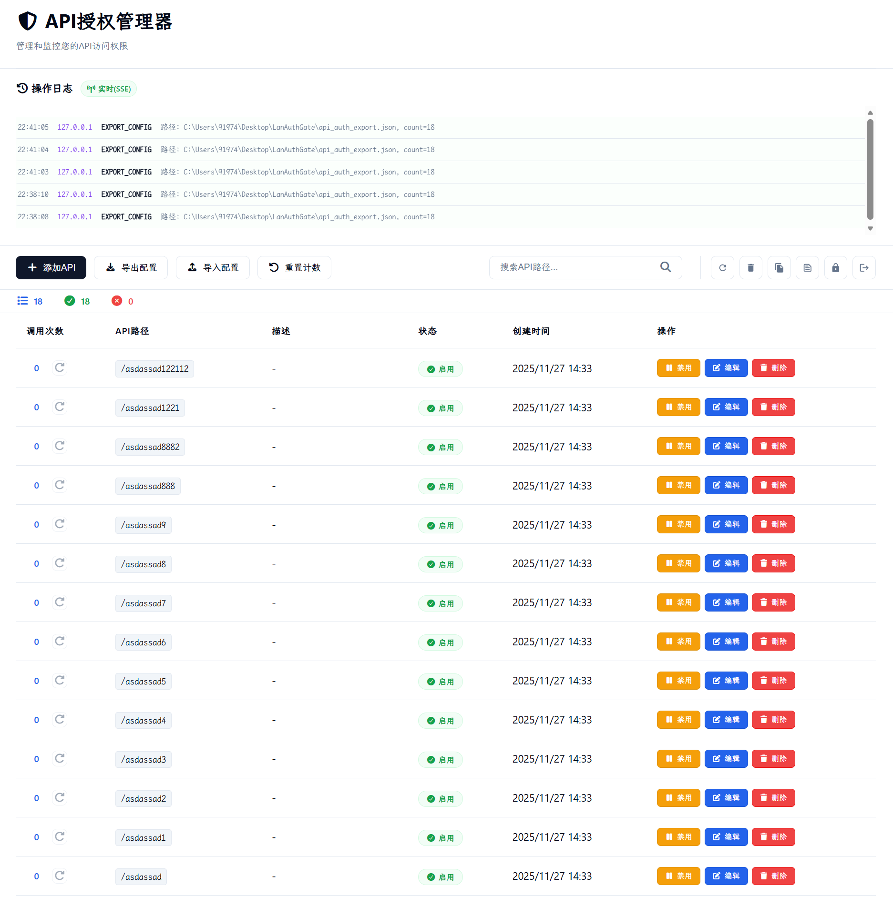

# LanAuthGate - API授权管理器

## 项目简介
LanAuthGate是一个基于Flask的API授权管理网关，提供完整的Web GUI界面用于管理和监控API访问权限。系统支持实时日志监控、密码安全管理、配置导入导出等功能，可以作为API网关的授权管理组件集成到现有系统中。



## 快速开始

1. 下载项目文件
2. 安装依赖:
    ```bash
     uv sync
    ```
3. 运行应用: 
    ```bash
     python main.py
    ```
4. 访问: http://localhost:5000
5. 使用初始密码: admin123

### 目录结构

```angular2html
LanAuthGate
 ├── api_auth.db(自动生成)
 ├── api_auth_export.json(自动生成)
 ├── logs
 │   └── app.log(自动生成)
 ├── static
 │   ├── css
 │   │   ├── all.min.css
 │   │   └── style.css
 │   ├── icons
 │   │   ├── api-2.svg
 │   │   └── favicon.svg
 │   ├── js
 │   │   └── script.js
 │   └── webfonts
 │       ├── fa-brands-400.woff2
 │       ├── fa-regular-400.woff2
 │       ├── fa-solid-900.woff2
 │       └── fa-v4compatibility.woff2
 ├── templates
 │   ├── index.html
 │   └── login.html
 ├── main.py
 ├── pyproject.toml
 ├── README.md
 └── uv.lock
```

### 使用例程库

```python
# auth_client.py
"""
LanAuthGate API授权检查客户端
提供简单的Python接口来检查API授权状态
"""

import requests
import logging
from typing import Dict, Any, Optional

class AuthClient:
    """API授权检查客户端"""
    
    def __init__(self, base_url: str = "http://localhost:5000"):
        """
        初始化授权客户端
        
        Args:
            base_url: LanAuthGate服务地址
        """
        self.base_url = base_url.rstrip('/')
        self.session = requests.Session()
        # 设置请求超时
        self.timeout = 10
        
        # 配置日志
        logging.basicConfig(
            level=logging.INFO,
            format='%(asctime)s - %(name)s - %(levelname)s - %(message)s'
        )
        self.logger = logging.getLogger('AuthClient')
    
    def check_auth(self, api_path: str, method: str = 'post') -> Dict[str, Any]:
        """
        检查API授权状态
        
        Args:
            api_path: 要检查的API路径
            method: 请求方法，'post' 或 'get'
            
        Returns:
            Dict包含授权状态和详细信息
            
        Raises:
            requests.RequestException: 网络请求错误
            ValueError: 参数错误
        """
        if not api_path:
            raise ValueError("API路径不能为空")
        
        # 确保路径以/开头
        if not api_path.startswith('/'):
            api_path = '/' + api_path
            
        self.logger.info(f"检查API授权: {api_path}")
        
        try:
            if method.lower() == 'post':
                return self._check_auth_post(api_path)
            elif method.lower() == 'get':
                return self._check_auth_get(api_path)
            else:
                raise ValueError("method参数必须是 'post' 或 'get'")
                
        except requests.RequestException as e:
            self.logger.error(f"授权检查请求失败: {e}")
            raise
    
    def _check_auth_post(self, api_path: str) -> Dict[str, Any]:
        """使用POST方法检查授权"""
        url = f"{self.base_url}/api/auth/check"
        payload = {"api_path": api_path}
        
        response = self.session.post(
            url, 
            json=payload, 
            timeout=self.timeout,
            headers={'Content-Type': 'application/json'}
        )
        response.raise_for_status()
        
        result = response.json()
        self.logger.info(f"授权检查结果: {api_path} -> {result.get('authorized', False)}")
        return result
    
    def _check_auth_get(self, api_path: str) -> Dict[str, Any]:
        """使用GET方法检查授权"""
        url = f"{self.base_url}/api/auth/check/get"
        params = {"path": api_path}
        
        response = self.session.get(
            url, 
            params=params, 
            timeout=self.timeout
        )
        response.raise_for_status()
        
        result = response.json()
        self.logger.info(f"授权检查结果: {api_path} -> {result.get('authorized', False)}")
        return result
    
    def batch_check_auth(self, api_paths: list, method: str = 'post') -> Dict[str, Dict[str, Any]]:
        """
        批量检查多个API的授权状态
        
        Args:
            api_paths: API路径列表
            method: 请求方法
            
        Returns:
            字典，key为API路径，value为授权结果
        """
        results = {}
        
        for api_path in api_paths:
            try:
                result = self.check_auth(api_path, method)
                results[api_path] = result
            except Exception as e:
                results[api_path] = {
                    'authorized': False,
                    'error': str(e),
                    'status': 'error'
                }
        
        return results
    
    def is_authorized(self, api_path: str, method: str = 'post') -> bool:
        """
        简化方法：只返回是否授权
        
        Args:
            api_path: API路径
            method: 请求方法
            
        Returns:
            bool: 是否授权
        """
        try:
            result = self.check_auth(api_path, method)
            return result.get('authorized', False)
        except Exception:
            return False
    
    def health_check(self) -> bool:
        """
        检查授权服务是否健康
        
        Returns:
            bool: 服务是否可用
        """
        try:
            url = f"{self.base_url}/api/auth/list"
            response = self.session.get(url, timeout=5)
            return response.status_code == 401  # 需要登录表示服务正常
        except Exception:
            return False
    
    def get_service_info(self) -> Dict[str, Any]:
        """
        获取授权服务信息
        
        Returns:
            服务信息字典
        """
        return {
            "base_url": self.base_url,
            "health": self.health_check(),
            "timeout": self.timeout
        }


# 装饰器版本
def require_auth(auth_client: AuthClient, api_path: str = None, method: str = 'post'):
    """
    授权检查装饰器
    
    Args:
        auth_client: AuthClient实例
        api_path: 要检查的API路径，如果为None则使用函数名
        method: 检查方法
    """
    def decorator(func):
        def wrapper(*args, **kwargs):
            # 如果未指定api_path，使用函数名
            check_path = api_path or f"/api/{func.__name__}"
            
            if not auth_client.is_authorized(check_path, method):
                raise PermissionError(f"API未授权: {check_path}")
            
            return func(*args, **kwargs)
        return wrapper
    return decorator


# 上下文管理器版本
class AuthContext:
    """授权检查上下文管理器"""
    
    def __init__(self, auth_client: AuthClient, api_path: str, method: str = 'post'):
        self.auth_client = auth_client
        self.api_path = api_path
        self.method = method
        self.is_authorized = False
    
    def __enter__(self):
        self.is_authorized = self.auth_client.is_authorized(self.api_path, self.method)
        if not self.is_authorized:
            raise PermissionError(f"API未授权: {self.api_path}")
        return self
    
    def __exit__(self, exc_type, exc_val, exc_tb):
        pass


# 使用示例和测试代码
if __name__ == "__main__":
    # 基本使用示例
    def demo_basic_usage():
        """基本使用示例"""
        print("=== LanAuthGate 客户端使用示例 ===")
        
        # 创建客户端实例
        client = AuthClient("http://localhost:5000")
        
        # 检查服务状态
        if not client.health_check():
            print("❌ 授权服务不可用，请确保LanAuthGate正在运行")
            return
        
        print("✅ 授权服务连接正常")
        
        # 检查单个API授权
        api_path = "/api/fastdem/v1"
        result = client.check_auth(api_path)
        print(f"检查 {api_path}: {result}")
        
        # 简化检查
        is_auth = client.is_authorized(api_path)
        print(f"简化检查 {api_path}: {'✅ 已授权' if is_auth else '❌ 未授权'}")
        
        # 批量检查
        apis = ["/api/fastdem/v1", "/api/fastdem/v2", "/api/fastfault/v1"]
        results = client.batch_check_auth(apis)
        print("批量检查结果:")
        for api, result in results.items():
            status = "✅ 已授权" if result.get('authorized') else "❌ 未授权"
            print(f"  {api}: {status}")
    
    # 装饰器使用示例
    def demo_decorator_usage():
        """装饰器使用示例"""
        print("\n=== 装饰器使用示例 ===")
        
        client = AuthClient("http://localhost:5000")
        
        @require_auth(client, "/api/user/profile")
        def get_user_profile(user_id):
            """获取用户资料"""
            print(f"获取用户 {user_id} 的资料")
            return {"user_id": user_id, "name": "示例用户"}
        
        try:
            result = get_user_profile(123)
            print(f"执行成功: {result}")
        except PermissionError as e:
            print(f"权限拒绝: {e}")
    
    # 上下文管理器使用示例
    def demo_context_usage():
        """上下文管理器使用示例"""
        print("\n=== 上下文管理器使用示例 ===")
        
        client = AuthClient("http://localhost:5000")
        
        try:
            with AuthContext(client, "/api/secure/operation") as auth:
                print("✅ 授权通过，执行安全操作")
                # 在这里执行需要授权的操作
                print("安全操作执行完成")
        except PermissionError as e:
            print(f"❌ 授权失败: {e}")
    
    # 集成到现有系统的示例
    class APIService:
        """示例API服务类"""
        
        def __init__(self, auth_client: AuthClient):
            self.auth_client = auth_client
        
        @require_auth(auth_client=None, api_path="/api/service/data")  # 在实例化时设置auth_client
        def get_data(self, data_id):
            """获取数据（需要授权）"""
            print(f"获取数据: {data_id}")
            return {"id": data_id, "content": "示例数据"}
        
        def set_auth_client(self, client):
            """设置授权客户端（用于装饰器）"""
            # 更新装饰器中的auth_client
            self.get_data = require_auth(client, "/api/service/data")(self.get_data.__wrapped__)
    
    def demo_integration():
        """集成示例"""
        print("\n=== 系统集成示例 ===")
        
        client = AuthClient("http://localhost:5000")
        service = APIService(client)
        service.set_auth_client(client)  # 设置授权客户端
        
        try:
            result = service.get_data("test_123")
            print(f"服务调用成功: {result}")
        except PermissionError as e:
            print(f"服务调用失败: {e}")
    
    # 运行所有示例
    try:
        demo_basic_usage()
        demo_decorator_usage()
        demo_context_usage()
        demo_integration()
    except Exception as e:
        print(f"示例执行失败: {e}")
        print("请确保LanAuthGate服务正在运行在 http://localhost:5000")
```

### 快速使用

```python
# quick_start.py
"""
快速开始示例 - 最简单的使用方式
"""

from auth_client import AuthClient

# 最简单的使用方式
def quick_check(api_path):
    """
    快速检查API授权
    
    Args:
        api_path: 要检查的API路径
        
    Returns:
        bool: 是否授权
    """
    client = AuthClient()  # 使用默认地址 http://localhost:5000
    return client.is_authorized(api_path)

# 单行版本
check_auth = lambda api_path: AuthClient().is_authorized(api_path)

if __name__ == "__main__":
    # 一行代码检查授权
    api = "/api/fastdem/v1"
    authorized = quick_check(api)
    print(f"{api} -> {'✅ 已授权' if authorized else '❌ 未授权'}")
    
    # 或者更简单
    result = check_auth("/api/fastdem/v2")
    print(f"/api/fastdem/v2 -> {'✅ 已授权' if result else '❌ 未授权'}")
```

## 功能特性

### 📊 实时监控
- 实时日志推送(SSE)
- 操作日志记录和查询
- 调用统计可视化
- 连接状态指示

### 🔧 配置管理
- JSON格式配置导入
- 配置一键导出备份
- 批量操作支持
- 数据持久化存储

### 🎨 用户界面
- 响应式Web设计
- 直观的操作界面
- 实时状态更新
- 快捷键支持

## 技术架构

### 后端技术栈
- **Web框架**: FastApi
- **数据库**: SQLite3
- **桌面化**: N/A
- **实时通信**: Server-Sent Events (SSE)

### 前端技术栈
- **核心**: 原生HTML5/CSS3/JavaScript
- **图标**: Font Awesome 7
- **样式**: 现代CSS变量和Flexbox布局
- **通信**: Fetch API + EventSource

## 版本历史
### v0.0.1 - 初始版本
- 基础API授权管理
- Web图形化管理界面
- 实时日志监控
- 配置导入导出
- 
### v0.0.2 - 初始版本
- 切换Flask为FastApi
- SSE实时日志
- 调整日志位置
- 增加API文档按钮

## 许可证
- 本项目基于MIT许可证开源，允许自由使用、修改和分发。
- 最后更新: 2025/11/27
- 项目维护: FastXTeam/大蘑菇
